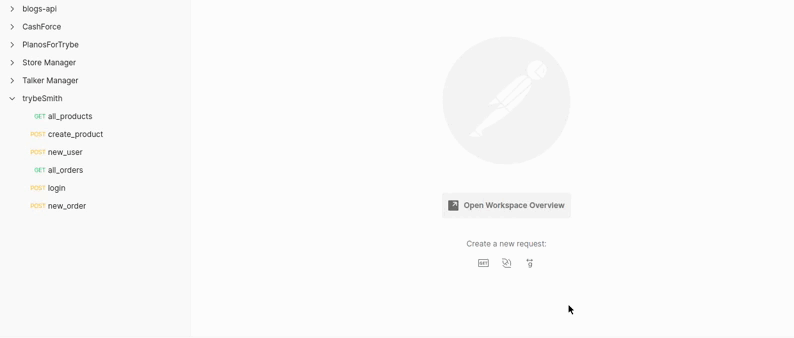
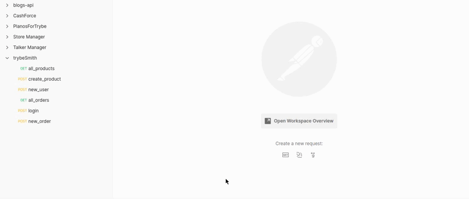

<div align="center"> 
    
</div>

<br>
<br>
<br>


<div align="center"> 
    
</div>

<br>
<br>

# Sumario
   - [Sobre](#sobre)
   - [Tecnologias](#tecnologias-utilizadas)
   - [Habilidades](#habilidades-desenvolvidas)
   - [Instruções](#instruções)
#

# Sobre

### Projeto desenvolvido enquanto estudante na [trybe](https://www.betrybe.com/formacao-desenvolvimento-web), me mantive utilizando a arquitetura MSC(model, service, controller), a API se refere a uma loja de itens medievais, foram implementadas  6 rotas, com diferentes funções, cada rota conta com um ou alguns middlewares de verificação das regras de negocio, lançando diferentes tipos de status codes, os diferenciais desse projeto foram, construção do projeto utilizando TypeScript, facilitando para futuras manutenções e auxiliando para haver menos quebras de código, e por fim a utilização de JWT(json web token) para autenticação de rotas.

#

# Tecnologias utilizadas
- [Postman](https://www.postman.com/)
- [MySQL Workbench](https://www.mysql.com/products/workbench/)
- [Node.js](https://nodejs.org/en/about/)
- [express](https://expressjs.com/pt-br/)
- [SQL](https://www.w3schools.com/sql/)
- [TypeScript](https://www.typescriptlang.org/)
#

# Habilidades desenvolvidas
- Criar e associar tabelas utilizando models e mysql2
- Construir endpoints para consumir os models que criar
- Fazer um CRUD com o TypeScript

#

# Instruções

```bash
    # Clonar repositório

    $ git clone https://github.com/furquin/smith

    # Entrar no diretório

    $ cd smith

    # Instalar dependências

    $ npm install

    # Iniciar a aplicação com nodemon

    $ npm run dev

    # Iniciar banco de dados

    $ npm run restore

```

<br>
<br>
<br>

### Desenvolvido por [Laert Furquin](https://github.com/furquin) 

